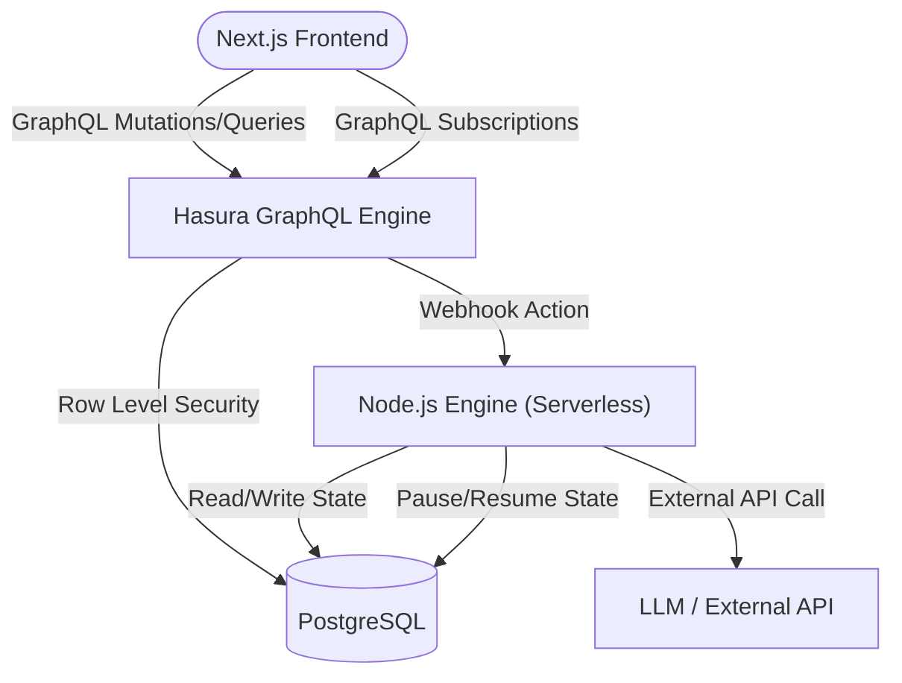

# AI Agent Workflow Builder


## Project Overview

A full-stack, production-quality SaaS platform for chaining AI agent steps (a mini n8n). This project focuses on strong multi-tenant data isolation, strict role-based access control, a stateless execution engine capable of pausing/resuming, and a premium developer-focused UI. 

**Repository:** [https://github.com/Tornado07-D/AI-Agent-Workflow-Builder](https://github.com/Tornado07-D/AI-Agent-Workflow-Builder)  

> [!NOTE]
> This platform requires a local Nhost environment to run the backend services (Auth, Postgres, Hasura, Functions).

## Tech Stack

- **Next.js 14** (App Router & React 19)
- **Nhost** (BaaS platform)
- **Hasura GraphQL Engine**
- **PostgreSQL**
- **Tailwind CSS v4**
- **@dnd-kit** (Drag and Drop)
- **Node.js Serverless Functions**

## Project Metrics

- ✔ **Complete Multi-tenant Architecture**
- ✔ **2-Layer Permission System** (DB Level + Execution Level)
- ✔ **Live GraphQL Subscriptions**
- ✔ **Stateless Pause & Resume Engine**
- ✔ **Interactive Visual Workflow Builder**
- ✔ **Usage Quota Tracking**

## Features

- **Visual Workflow Builder**: Add, edit, and drag-and-drop steps to create complex AI chains.
- **Role-Based Access**: Workspaces enforce isolation. Owners can edit and approve; viewers are read-only.
- **Approval Gates**: Workflows can pause mid-execution, safely yielding serverless memory, and resume exactly where they left off upon authorization.
- **Live Execution Tracking**: Step-by-step progress streams directly to the frontend in real-time via WebSockets.
- **External Webhooks**: Trigger workflows from external systems with secure tokens.
- **Robust Error Handling**: Safely catches external API failures (like 503s) without crashing the engine.

## Architecture



## Folder Structure

```text
AI-Agent-Workflow-Builder/
├── README.md
├── ARCHITECTURE.md
├── seed.ts
├── frontend/                 # Next.js Application
│   ├── src/
│   │   ├── app/              # Routes, Layouts, Global CSS
│   │   ├── components/       # UI Components (WorkflowBuilder, Providers)
│   │   └── lib/              # Nhost Client setup
│   └── package.json
└── nhost/                    # Backend Configuration
    ├── metadata/             # Hasura Schema, Permissions, Actions
    ├── migrations/           # PostgreSQL Migrations
    └── functions/            # Node.js Serverless Execution Engine
```

## Installation

1. [Docker Desktop](https://www.docker.com/products/docker-desktop) and [Nhost CLI](https://docs.nhost.io/cli) are required.
2. Clone this repository and navigate to the directory:
```bash
git clone https://github.com/Tornado07-D/AI-Agent-Workflow-Builder.git
cd AI-Agent-Workflow-Builder
```

3. Start the Nhost backend services:
```bash
nhost up
```

4. Seed the database with demo users, orgs, and workflows:
```bash
npx tsx seed.ts
```

5. Install and start the Next.js frontend:
```bash
cd frontend
npm install --legacy-peer-deps
npm run dev
```

## Running the Application

Once both the backend and frontend are running, open your browser to:
[http://localhost:3000](http://localhost:3000)

**Demo Accounts (Password: `password123`)**
- Owner: `ownerA@orga.com` (Full control)
- Viewer: `viewerA@orga.com` (Read-only)

## Triggering via Webhook

You can trigger a workflow programmatically via the Hasura Action endpoint:

```bash
curl -X POST http://localhost:1337/v1/functions/webhookTrigger \
  -H "Content-Type: application/json" \
  -d '{"workflow_id": "YOUR_WORKFLOW_ID", "token": "secret-token-123"}'
```

## Design Decisions

- **Stateless Execution Engine**: The execution engine intentionally terminates at `approval_gate` steps. It does not hold memory or idle connections. It fully serializes the state to Postgres, and a separate mutation resumes it from a cold start.
- **Two-Layer Security**: 
  - *Layer 1 (Data)*: Hasura Row Level Security (RLS) ensures users can never query data outside their organization. 
  - *Layer 2 (Execution)*: Serverless Action handlers re-verify caller roles against the database before executing mutations, guaranteeing that an editor cannot bypass an approval gate.
- **JSONB Configuration**: Step configurations are stored as JSONB to allow dynamic evolution of new step types without requiring heavy schema migrations.
- **Premium Flat UI**: The frontend utilizes a stark, flat dark mode inspired by tools like Vercel and Linear, emphasizing clarity and professionalism over generic styling.
