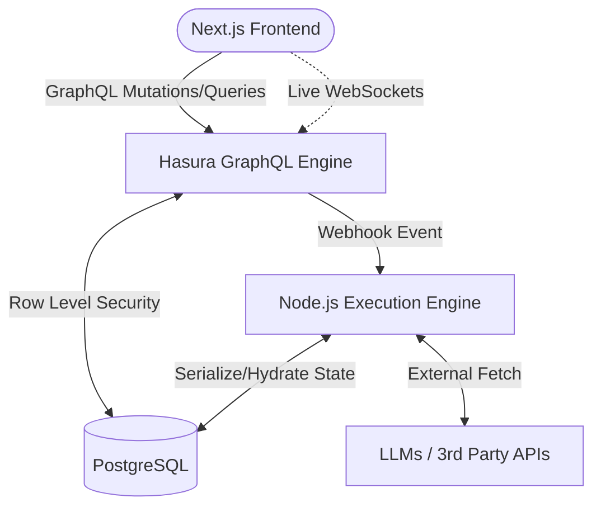

# AI Agent Workflow Builder

A full-stack mini-n8n for building and executing multi-step AI workflows with multi-tenant isolation, role-based authorization, approval gates, and real-time execution streaming.

Next.js · TypeScript · Nhost · Hasura GraphQL · PostgreSQL · Node.js

[Live Demo](#) · [Video Walkthrough](#) · [Architecture Details](ARCHITECTURE.md)

## Final Task — End-to-End Demonstration

This implementation was engineered specifically to pass the final evaluation scenario.

### Workflow
`LLM Call` → `HTTP Request` → `Conditional Branch` → `Approval Gate`

### Execution Mapping
1. **Org A owner creates the workflow.**
2. **Workflow starts manually** through GraphQL.
3. **LLM step executes** against an LLM API (stubbed with artificial delay).
4. **HTTP step calls an external API** (`httpbin.org`).
5. **Conditional branch evaluates** the LLM output.
6. **Approval gate pauses execution.**
7. **GraphQL subscription streams** the paused state to the UI live without refreshing.
8. **An authorized Org A user approves** the step via the UI.
9. **Execution resumes** from persisted PostgreSQL state.
10. **The same workflow can also be triggered through a webhook.**
11. **Cross-Tenant Isolation:** An Org B user cannot query, trigger, or approve Org A resources, including when directly supplying an Org A workflow ID (enforced via DB-level RLS).

---

## Key Engineering Highlights

### 1. Multi-Tenant Isolation (Layer 1)
PostgreSQL Row-Level Security scopes all organization-owned data through the `org_members` table. A user in Org B is mathematically prevented from querying Org A's workflows.

### 2. Two-Layer Authorization (Layer 2)
* **Layer 1 (Data Access):** Hasura/PostgreSQL RLS prevents cross-organization reads and writes.
* **Layer 2 (Execution Authorization):** Serverless Action handlers independently verify organization membership and role before sensitive execution operations (e.g., verifying if a user is an `owner` or `editor` before resuming a paused workflow).

### 3. Stateless Pause / Resume
The serverless execution does not keep an in-memory process alive while waiting for approval. Execution state is persisted to PostgreSQL, allowing the function to gracefully terminate and resume later from the exact persisted state.

---

## Tech Stack
- **Next.js 14** (App Router & React 19)
- **Nhost** (BaaS platform)
- **Hasura GraphQL Engine**
- **PostgreSQL 14**
- **Tailwind CSS v4**
- **Node.js Serverless Functions**

## Features
- **Visual Workflow Builder**: Add, edit, and drag-and-drop steps to create complex AI chains.
- **Granular RBAC**: Owners, Editors, and Viewers have strictly enforced boundaries.
- **Approval Gates**: Workflows can pause mid-execution, safely yielding serverless memory, and resume upon authorization.
- **Live Execution Tracking**: Step-by-step progress streams directly to the frontend via WebSockets.
- **External Webhooks**: Trigger workflows from external systems with secure tokens.

## Architecture



## Folder Structure

```text
AI-Agent-Workflow-Builder/
├── README.md
├── ARCHITECTURE.md
├── seed.ts
├── frontend/                 # Next.js Application
│   ├── src/app/              # Routes, Layouts, Global CSS
│   ├── src/components/       # UI Components (WorkflowBuilder)
│   └── src/lib/              # Nhost Client setup
└── nhost/                    # Backend Configuration
    ├── metadata/             # Hasura Schema, Permissions, Actions
    ├── migrations/           # PostgreSQL Migrations
    └── functions/            # Node.js Serverless Execution Engine
```

## Installation

1. [Docker Desktop](https://www.docker.com/products/docker-desktop) and [Nhost CLI](https://docs.nhost.io/cli) are required.
2. Clone this repository and navigate to the directory:
```bash
git clone https://github.com/Tornado07-D/AI-Agent-Workflow-Builder.git
cd AI-Agent-Workflow-Builder
```

3. Start the Nhost backend services:
```bash
nhost up
```

4. Seed the database with demo users, orgs, and workflows:
```bash
npm install node-fetch @nhost/nhost-js
npx tsx seed.ts
```

5. Install and start the Next.js frontend:
```bash
cd frontend
npm install --legacy-peer-deps
npm run dev
```

## Triggering via Webhook

You can trigger a workflow programmatically via the Hasura Action endpoint:

```bash
curl -X POST http://localhost:1337/v1/functions/webhookTrigger \
  -H "Content-Type: application/json" \
  -d '{"workflow_id": "YOUR_WORKFLOW_ID", "token": "secret-token-123"}'
```
